<!DOCTYPE html>
<html lang="es">

<head>
    <meta charset="UTF-8">
    <meta name="viewport" content="width=device-width, initial-scale=1.0">
    <title>FEHCAFOR</title>
    
    <link href="https://fonts.googleapis.com/css2?family=Poppins:wght@300;400;600;700&display=swap" rel="stylesheet">
    
</head>

<body class="bg-gray-50">
    <!-- Scroll to Top Button -->
    <button class="scroll-to-top" onclick="window.scrollTo({top: 0, behavior: 'smooth'})"
        aria-label="Ir arriba">↑</button>

    <!-- Barra de navegación -->
    <nav
        class="bg-green-900 bg-opacity-95 backdrop-blur-sm text-white fixed top-0 w-full z-50 flex justify-between items-center navbar-spaced transition-all duration-300">
        <ul class="flex space-x-8">
            <li><a href="inicio.html" class="hover:text-yellow-400 font-semibold transition duration-200">Inicio</a>
            </li>
            <li><a href="quienes-somos.html" class="hover:text-yellow-400 font-semibold transition duration-200">Quiénes
                    Somos</a></li>
            <li><a href="sala-informativa.html" class="hover:text-yellow-400 font-semibold transition duration-200">Sala
                    Informativa</a>
            </li>
            <li><a href="galeria.html" class="hover:text-yellow-400 font-semibold transition duration-200">Galeria</a>
            </li>
            <li><a href="enlaces-interes.html"
                    class="hover:text-yellow-400 font-semibold transition duration-200">Enlaces de Interes</a></li>

            <li><a href="contactos.html"
                    class="hover:text-yellow-400 font-semibold transition duration-200">contactanos</a>
            </li>
        </ul>
    </nav>

    <!-- Sección fija para el logo -->
    

        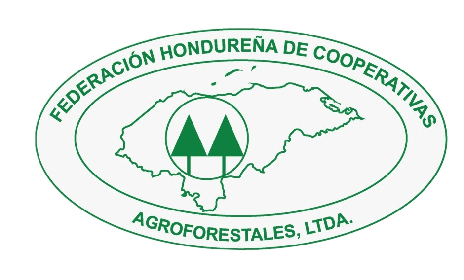
        

            <h1 class="text-3xl font-bold text-green-700 mb-2">FEHCAFOR</h1>
            
<b>FEDERACIÓN HONDUREÑA DE COOPERATIVAS AGROFORESTALES</b>

        

    
        

    <!-- Slider hero -->
    <section class="hero-slider">
        

            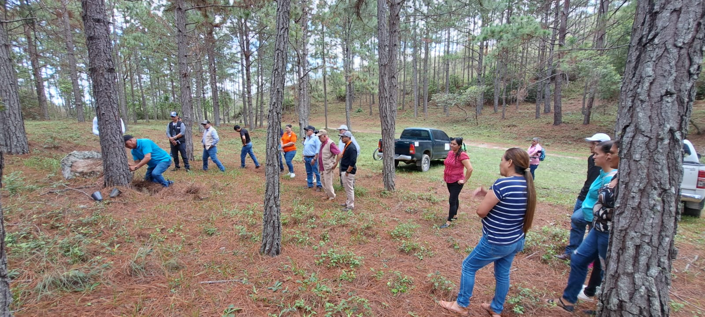
            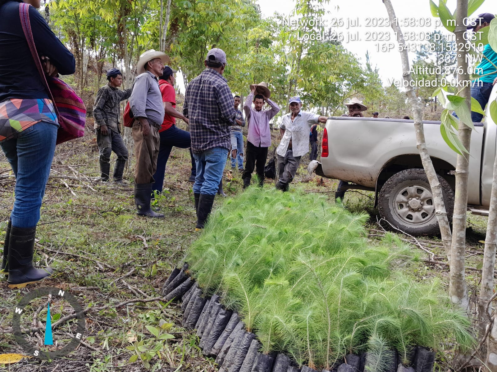
            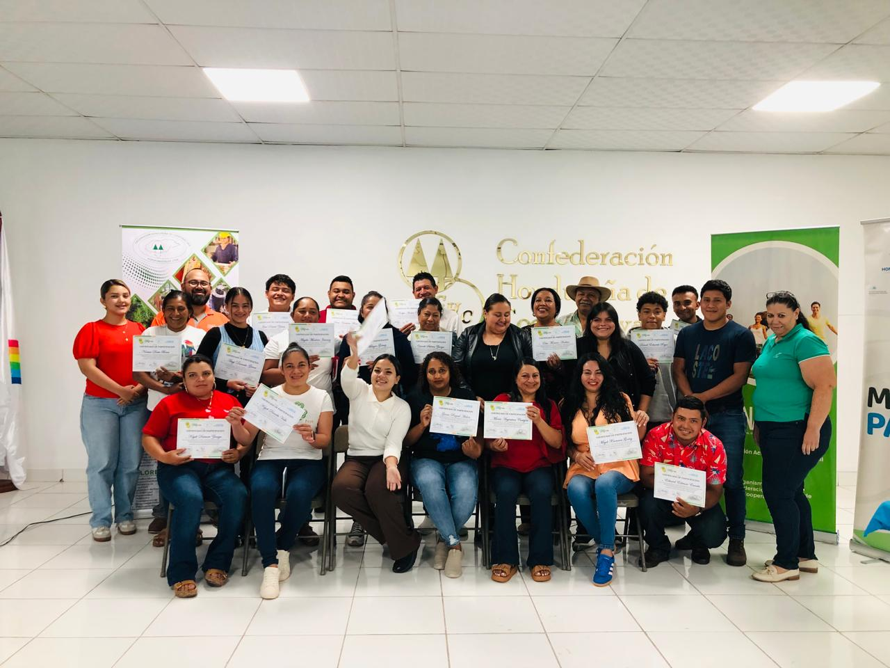
            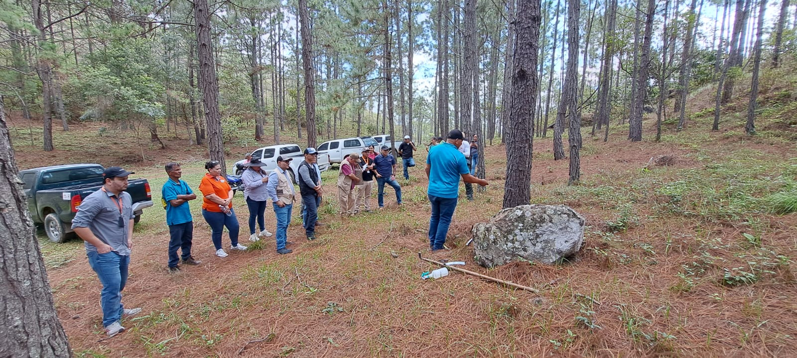
            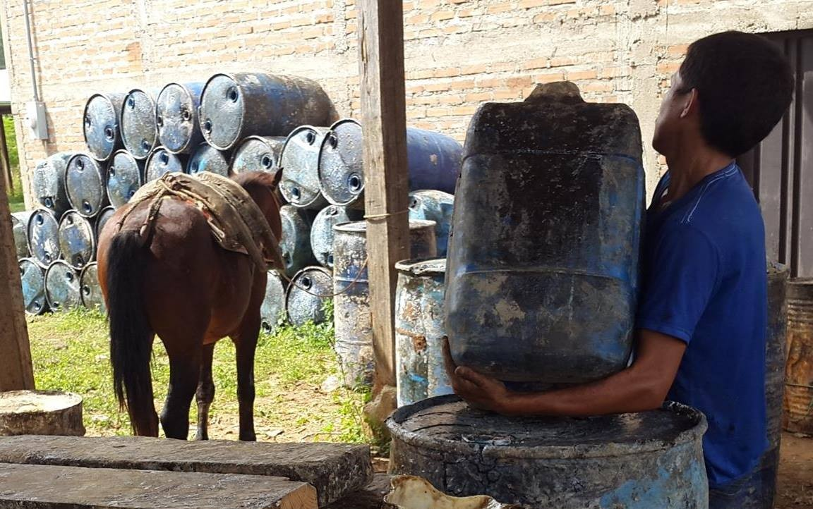
            
        

    </section>

    <!-- Sección de Nuestros Principios y Visión, ahora más atractiva e interactiva -->
    <section class="py-20" style="background-color: #ffffff;">
        

            <h2 class="text-4xl font-bold text-center text-green-800 mb-16"></h2>
            

                

                    <h3 class="text-2xl font-semibold text-black mb-6 text-center"> Visión</h3>
                    
Ser la organización grado lider, competitiva y sostenible del sector
                        agroforestal que promueve e impulsa el desarrollo ambiental, social y económico entre sus
                        organizaciones socias, basando su accionar en la aplicación de los principios y valores del
                        sector cooperativo.

                    <button class="bg-black text-white py-2 px-4 rounded mt-4" onclick="openModal('vision')">Ver
                        más</button>
                

                

                    <h3 class="text-2xl font-semibold text-black mb-6 text-center"> Principios Cooperativos</h3>
                    
1. Membresia abierta y voluntaria    2. Control democrático
                        de los miembros    3. Participacion económica de los miembros    4. Autonomia e
                        Independencia    5. Educación, Formación e Información    6. Compromiso con la
                        comunidad    7. Cooperación entre cooperativas

                    <button class="bg-black text-white py-2 px-4 rounded mt-4" onclick="openModal('principios')">Ver
                        más</button>
                

                

                    <h3 class="text-2xl font-semibold text-black mb-6 text-center"> Misión</h3>
                    
Somos una organización de segundo grado del movimiento cooperativo hondureño,
                        que busca el desarrollo económico, ecológico y social de sus cooperativas de base, lográndolo a
                        traves de su representación gremial y brindando de manera eficiente y efectiva los servicios de
                        asesoría económica, empresarial, técnico y legal.

                    <button class="bg-black text-white py-2 px-4 rounded mt-4" onclick="openModal('mision')">Ver
                        más</button>
                

            

        

    </section>

    <!-- Modal para interactividad -->
    

        

            &times;
            <h3 id="modal-title" class="text-2xl font-bold text-green-800 mb-4"></h3>
            

        

    

    <!-- Presentación de la institución -->
    <section id="quienes-somos" class="py-20 bg-gradient-to-r from-gray-100 to-green-50">
        

            <h2 class="text-4xl font-bold text-black-900 mb-10">Presentación de Nuestra Federación</h2>
           
            

              <video controls>
               <source src="img/presentacion.mp4" type="video/mp4">
              </video>
             
            

        

    </section>

    <!-- Sección Historia -->
    <section id="historia" class="py-20 bg-white">
        

            <h2 class="text-4xl font-bold text-center text-black-900 mb-10">Historia</h2>
            

                La Federación Hondureña de Cooperativas Agroforestales “FEHCAFOR” fue fundada el 8 de Agosto de 1974.
                En la actualidad FEHCAFOR cuenta con 96 Cooperativas afiliadas que agrupan aproximadamente a 4,800
                cooperativistas que se benefician en forma directa del manejo sostenible de recursos forestales, con un
                promedio de 24,000 personas que se relacionan en las actividades de trabajo con los mismos.
            

        

    </section>

    <!-- Pie de página -->
    <footer class="bg-green-900 text-white py-6 text-center">
        
&copy; 2025 FEHCAFOR.

    </footer>

    
</body>

</html>

<!DOCTYPE html>
<html lang="es">

<head>
    <meta charset="UTF-8">
    <meta name="viewport" content="width=device-width, initial-scale=1.0">
    <title>FEHCAFOR - Quienes-somos</title>
    
    <link href="https://fonts.googleapis.com/css2?family=Poppins:wght@300;400;600;700&display=swap" rel="stylesheet">
    
</head>

<body class="bg-gray-50">
    <!-- Scroll to Top Button -->
    <button class="scroll-to-top" onclick="window.scrollTo({top: 0, behavior: 'smooth'})"
        aria-label="Ir arriba">↑</button>

    <!-- Barra de navegación -->
    <nav
        class="bg-green-900 bg-opacity-95 backdrop-blur-sm text-white fixed top-0 w-full z-50 flex justify-between items-center navbar-spaced transition-all duration-300">
        <ul class="flex space-x-8">
            <li><a href="inicio.html" class="hover:text-yellow-400 font-semibold transition duration-200">Inicio</a>
            </li>
            <li><a href="quienes-somos.html" class="hover:text-yellow-400 font-semibold transition duration-200">Quiénes
                    Somos</a></li>
            <li><a href="sala-informativa.html" class="hover:text-yellow-400 font-semibold transition duration-200">Sala
                    Informativa</a>
            </li>
            <li><a href="galeria.html" class="hover:text-yellow-400 font-semibold transition duration-200">Galeria</a>
            </li>
            <li><a href="enlaces-interes.html"
                    class="hover:text-yellow-400 font-semibold transition duration-200">Enlaces de Interes</a></li>

            <li><a href="contactos.html"
                    class="hover:text-yellow-400 font-semibold transition duration-200">contactanos</a>
            </li>
        </ul>
    </nav>

    <!-- Sección fija para el logo y texto debajo de la barra de navegación -->
    

        <!-- Reduje el tamaño para que quepa mejor -->
        

            <h1 class="text-3xl font-bold text-green-700 mb-2">FEHCAFOR</h1>
            
<b>FEDERACIÓN HONDUREÑA DE COOPERATIVAS AGROFORESTALES</b>

        

    
        

    <!-- Sección Quiénes Somos - Interactiva y Llamativa -->
    <section id="quienes-somos" class="py-24 bg-green-100 animate-fadeIn">
        

            <h2 class="text-5xl font-bold text-center text-green-800 mb-12">Quiénes Somos en FEHCAFOR</h2>
            

                <!-- Tarjeta 1: Historia -->
                

                    <h3 class="text-3xl font-semibold text-green-600 mb-4">Nuestra Historia</h3>
                    
FEHCAFOR fue fundada en 1974 como una federación de cooperativas agroforestales en Honduras. Surgimos para unir esfuerzos en el manejo sostenible de recursos forestales y apoyar a comunidades rurales a través de iniciativas colectivas.

                    <button onclick="window.open('https://www.fehcafor.org', '_blank')" class="bg-blue-500 text-white py-2 px-4 rounded hover:bg-blue-600 transition">Más sobre nuestra historia</button>
                

                
                <!-- Tarjeta 2: Estructura y Miembros -->
                

                    <h3 class="text-3xl font-semibold text-green-600 mb-4">Estructura y Miembros</h3>
                    
Somos una organización que agrupa a 96 cooperativas, representando a más de 4,800 cooperativistas. Nuestros miembros trabajan en equipo para fomentar el desarrollo en áreas rurales, con un enfoque en la inclusión y la sostenibilidad.

                    <button onclick="alert('Explora más sobre nuestros miembros en Facebook!')" class="bg-yellow-500 text-white py-2 px-4 rounded hover:bg-yellow-600 transition">Ver miembros interactivos</button>
                

                
                <!-- Tarjeta 3: Actividades y Proyectos -->
                

                    <h3 class="text-3xl font-semibold text-green-600 mb-4">Actividades y Proyectos</h3>
                    
Nuestras actividades incluyen reforestación, capacitación en agricultura ecológica y alianzas internacionales. Participamos en proyectos que combaten la deforestación y generan empleos en Honduras.

                    <button onclick="window.open('https://www.fehcafor.org', '_blank')" class="bg-purple-500 text-white py-2 px-4 rounded hover:bg-purple-600 transition">Explorar proyectos</button>
                

                
                <!-- Tarjeta 4: Impacto -->
                

                    <h3 class="text-3xl font-semibold text-green-600 mb-4">Nuestro Impacto</h3>
                    
Hemos impactado a más de 24,000 personas a través de empleos y desarrollo comunitario. Nuestros esfuerzos protegen el medio ambiente y fortalecen la economía local en Honduras.

                    <button onclick="window.open('https://www.facebook.com/FEHCAFOR', '_blank')" class="bg-red-500 text-white py-2 px-4 rounded hover:bg-red-600 transition">Ver impacto en acción</button>
                

            

        

    </section>

    <!-- Pie de página -->
    <footer class="bg-green-900 text-white py-6 text-center">
        
&copy; 2025 FEHCAFOR.

    </footer>

    
</body>
</html>

<!DOCTYPE html>
<html lang="es">

<head>
    <meta charset="UTF-8">
    <meta name="viewport" content="width=device-width, initial-scale=1.0">
    <title>FEHCAFOR - sala-informativa</title>
    
    <link href="https://fonts.googleapis.com/css2?family=Poppins:wght@300;400;600;700&display=swap" rel="stylesheet">
    
</head>

<body class="bg-gray-50">
    <!-- Scroll to Top Button -->
    <button class="scroll-to-top" onclick="window.scrollTo({top: 0, behavior: 'smooth'})"
        aria-label="Ir arriba">↑</button>

    <!-- Barra de navegación -->
    <nav
        class="bg-green-900 bg-opacity-95 backdrop-blur-sm text-white fixed top-0 w-full z-50 flex justify-between items-center navbar-spaced transition-all duration-300">
        <ul class="flex space-x-8">
            <li><a href="inicio.html" class="hover:text-yellow-400 font-semibold transition duration-200">Inicio</a>
            </li>
            <li><a href="quienes-somos.html" class="hover:text-yellow-400 font-semibold transition duration-200">Quiénes
                    Somos</a></li>
            <li><a href="sala-informativa.html" class="hover:text-yellow-400 font-semibold transition duration-200">Sala
                    Informativa</a>
            </li>
            <li><a href="galeria.html" class="hover:text-yellow-400 font-semibold transition duration-200">Galeria</a>
            </li>
            <li><a href="enlaces-interes.html"
                    class="hover:text-yellow-400 font-semibold transition duration-200">Enlaces de Interes</a></li>

            <li><a href="contactos.html"
                    class="hover:text-yellow-400 font-semibold transition duration-200">contactanos</a>
            </li>
        </ul>
    </nav>

    <!-- Sección fija para el logo y texto debajo de la barra de navegación -->
    

        <!-- Reduje el tamaño para que quepa mejor -->
        

            <h1 class="text-3xl font-bold text-green-700 mb-2">FEHCAFOR</h1>
            
<b>FEDERACIÓN HONDUREÑA DE COOPERATIVAS AGROFORESTALES</b>

        

    
        

    <!-- Contenido de Sala Informativa -->
    <header id="inicio" class="py-20 bg-green-600 text-white text-center">
        

            <h1 class="text-4xl font-bold mb-4">Capacitaciones y Asambleas</h1>
            
Encuentra información sobre los eventos, capacitaciones y asambleas de FEHCAFOR. Todo el
                contenido detallado está disponible en nuestra página de Facebook.

        

    </header>

    <!-- Sección de Capacitaciones -->
    <section id="capacitaciones" class="py-16">
        

            <h2 class="text-3xl font-bold text-center mb-6">Capacitaciones de FEHCAFOR</h2>
            

                
FEHCAFOR ofrece capacitaciones en temas como manejo sostenible de recursos
                    forestales, agricultura ecológica y desarrollo comunitario. Estas sesiones incluyen talleres
                    prácticos y cursos para empoderar a cooperativistas y comunidades rurales.

                
Para ver los detalles de las próximas capacitaciones, horarios,
                    inscripciones y materiales, visita nuestra página de Facebook donde publicamos actualizaciones
                    regulares.

                <a href="https://www.facebook.com/FEHCAFOR" target="_blank" class="btn-facebook block mx-auto w-fit">Ir
                    a Facebook para más información</a>
            

        

    </section>

    <!-- Sección de Asambleas -->
    <section id="asambleas" class="py-16 bg-gray-100">
        

            <h2 class="text-3xl font-bold text-center mb-6">Asambleas y Eventos</h2>
            

                
Las asambleas de FEHCAFOR son eventos clave para discutir temas
                    importantes como el control democrático, planes de acción y alianzas. Incluyen reuniones generales,
                    conferencias y actividades comunitarias.

                
Encuentra fechas, agendas, resúmenes y fotos de asambleas pasadas en
                    nuestra página de Facebook. ¡Síguenos para no perderte ningún evento!

                <a href="https://www.facebook.com/FEHCAFOR" target="_blank" class="btn-facebook block mx-auto w-fit">Ver
                    asambleas en Facebook</a>
            

        

    </section>

    <!-- Sección de Contacto -->
<section id="contacto" class="py-16">
    

        <h2 class="text-3xl font-bold text-center mb-6">Contacto</h2>
        

            
Si necesitas más detalles sobre capacitaciones o asambleas, contáctanos directamente:

            
<strong>Correo:</strong> <a href="mailto:fehcafor1974@gmail.com" class="text-blue-600 hover:underline">fehcafor1974@gmail.com</a>

            
<strong>Teléfono:</strong> <a href="tel:+50422270059" class="text-blue-600 hover:underline">+504 2227-0059</a>

           
<strong>Dirección:</strong> <a
                            href="https://www.google.com/maps/search/Colonia+Mayangle+2da+entrada%2C+casa+1659%2C+una+cuadra+Oeste+de+Cruz+Roja+Hondureña%2C+Comayagüela%2C+Honduras"
                            target="_blank" class="text-blue-600 hover:underline">Col- Mayangle. esquina opuesta a Cruz
                            Roja Hondureña, contiguo a Save The Childrens, Casa No. 2211.</a>

            
O síguenos en redes para actualizaciones en tiempo real:

            <a href="https://www.facebook.com/FEHCAFOR" target="_blank" class="text-blue-600 hover:underline">Página de Facebook de FEHCAFOR</a>
        

    

</section>

    <!-- Pie de página -->
    <footer class="bg-green-900 text-white py-6 text-center">
        
&copy; 2025 FEHCAFOR.

    </footer>

    
</body>

</html>

<!DOCTYPE html>
<html lang="es">

<head>
    <meta charset="UTF-8">
    <meta name="viewport" content="width=device-width, initial-scale=1.0">
    <title>FEHCAFOR - Galeria</title>
    
    <link href="https://fonts.googleapis.com/css2?family=Poppins:wght@300;400;600;700&display=swap" rel="stylesheet">
    
</head>

<body class="bg-gray-50">
    <!-- Scroll to Top Button -->
    <button class="scroll-to-top" onclick="window.scrollTo({top: 0, behavior: 'smooth'})"
        aria-label="Ir arriba">↑</button>

    <!-- Barra de navegación -->
    <nav
        class="bg-green-900 bg-opacity-95 backdrop-blur-sm text-white fixed top-0 w-full z-50 flex justify-between items-center navbar-spaced transition-all duration-300">
        <ul class="flex space-x-8">
            <li><a href="inicio.html" class="hover:text-yellow-400 font-semibold transition duration-200">Inicio</a>
            </li>
            <li><a href="quienes-somos.html" class="hover:text-yellow-400 font-semibold transition duration-200">Quiénes
                    Somos</a></li>
            <li><a href="sala-informativa.html" class="hover:text-yellow-400 font-semibold transition duration-200">Sala
                    Informativa</a>
            </li>
            <li><a href="galeria.html" class="hover:text-yellow-400 font-semibold transition duration-200">Galeria</a>
            </li>
            <li><a href="enlaces-interes.html"
                    class="hover:text-yellow-400 font-semibold transition duration-200">Enlaces de Interes</a></li>

            <li><a href="contactos.html"
                    class="hover:text-yellow-400 font-semibold transition duration-200">contactanos</a>
            </li>
        </ul>
    </nav>

    <!-- Sección fija para el logo (sin cambios) -->
    

        
        

            <h1 class="text-3xl font-bold text-green-700 mb-2">FEHCAFOR</h1>
            
<b>FEDERACIÓN HONDUREÑA DE COOPERATIVAS AGROFORESTALES</b>

        

    
        

    <!-- Introducción a la galería -->
    <section class="py-16 bg-gradient-to-r from-green-100 to-green-200 text-center animate-fadeIn">
        <h2 class="text-4xl font-bold text-green-800 mb-4">¡Descubre Nuestra Galería de Momentos Increíbles!</h2>
        
Explora imágenes organizadas por secciones y años. Selecciona
            las fotos de Capacitación, Asamblea, Proyectos y Eventos para 2024 o 2025, y vive la experiencia interactiva
            con solo un clic.

        

            <a href="#capacitacion"
                class="bg-green-600 text-white px-4 py-2 rounded hover:bg-green-700">Capacitación</a>
            <a href="#asamblea" class="bg-green-600 text-white px-4 py-2 rounded hover:bg-green-700">Asamblea</a>
            <a href="#proyectos" class="bg-green-600 text-white px-4 py-2 rounded hover:bg-green-700">Proyectos</a>
            <a href="#eventos" class="bg-green-600 text-white px-4 py-2 rounded hover:bg-green-700">Eventos</a>
            <a href="#aserradero" class="bg-green-600 text-white px-4 py-2 rounded hover:bg-green-700">Aserradero</a>
        

    </section>

    <!-- Secciones de Galería -->
    <section id="galeria" class="py-12">
        <!-- Sección: Capacitación -->
        <section id="capacitacion" class="gallery-section">
            <h3 class="text-3xl font-bold text-center text-green-800 mb-6">Capacitaciones 2025</h3>
            

                <!-- Casilla 2024 -->
                

                    

                        
                        
                    

                

                <!-- Casilla 2025 -->
                

                    

                        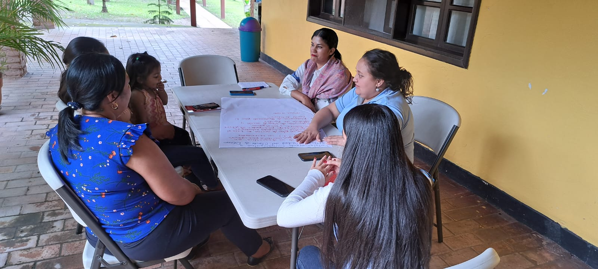
                        
                    

                

            

        </section>

        <!-- Sección: Asamblea -->
        <section id="asamblea" class="gallery-section">
            <h3 class="text-3xl font-bold text-center text-green-800 mb-6">Asamblea</h3>
            

                <!-- Casilla 2024 -->
                

                    <h4 style="text-align: center;" class="text-2xl font-bold text-green-600 mb-4">2024</h4>
                    

                        
                        
                        
                        
                    

                

                <!-- Casilla 2025 -->
                

                    <h4 style="text-align: center;" class="text-2xl font-bold text-green-600 mb-4">2025</h4>
                    

                        
                        
                        
                        
                    

                

            

        </section>

        <!-- Sección: Proyectos -->
        <section id="proyectos" class="gallery-section">
            <h3 class="text-3xl font-bold text-center text-green-800 mb-6">Proyectos 2025</h3>
            

                <!-- Casilla 2024 -->
                

                    

                        
                        
                        
                        
                    

                

                <!-- Casilla 2025 -->
                

                    

                        
                        
                        
                        
                    

                

            

        </section>

        <!-- Sección: Eventos -->
        <section id="eventos" class="gallery-section">
            <h3 class="text-3xl font-bold text-center text-green-800 mb-6">Eventos</h3>
            

                <!-- Casilla 2024 -->
                

                    <h4 style="text-align: center;" class="text-2xl font-bold text-green-600 mb-4">2024</h4>
                    

                        
                        
                        
                        
                    

                

                <!-- Casilla 2025 -->
                

                    <h4 class="text-2xl font-bold text-green-600 mb-4">2025</h4>
                    

                        
                        
                        
                        
                    

                

            

        </section>

        <!-- Sección: aserradero -->
        <section id="aserradero" class="gallery-section">
            <h3 class="text-3xl font-bold text-center text-green-800 mb-6">Aserradero</h3>
            

                <!-- Casilla 2024 -->
                

                    

                        
                        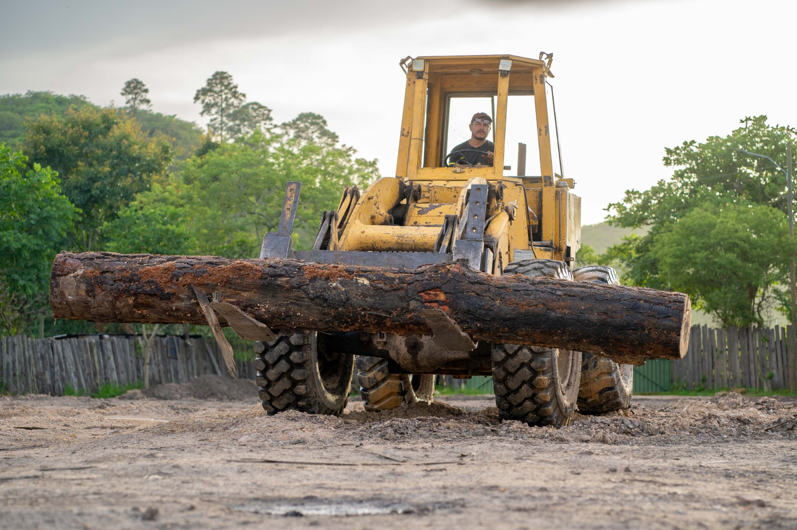
                        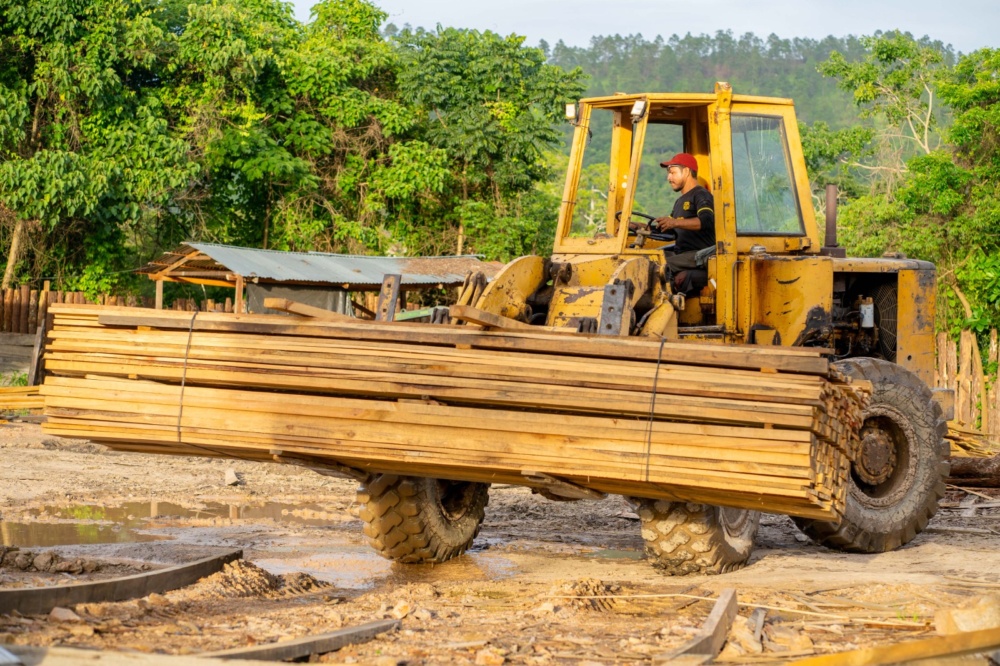
                        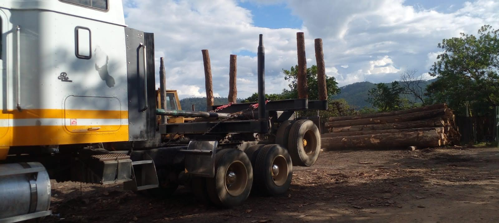
                    

                

                <!-- Casilla 2025 -->
                

                    

                        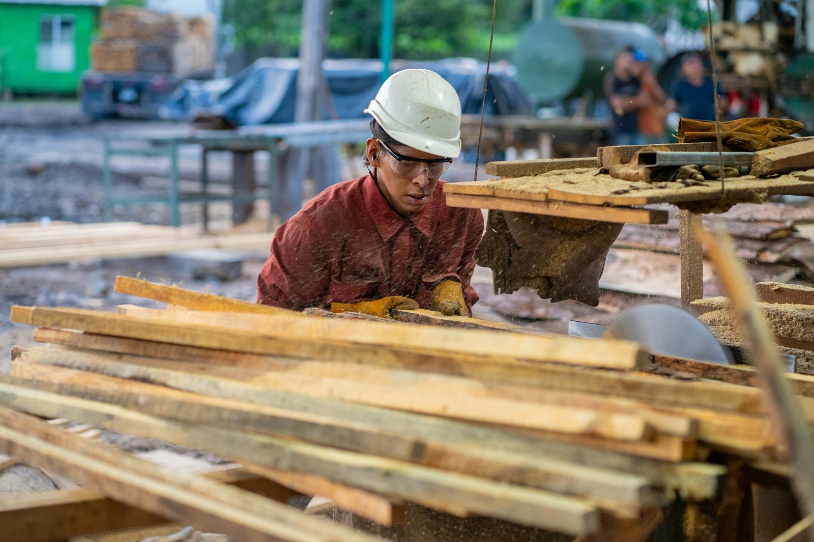
                        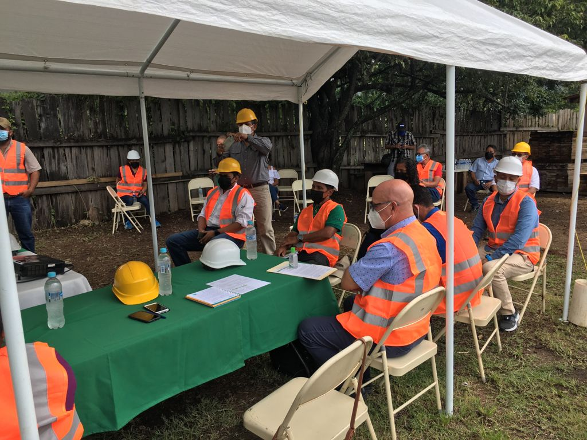
                        <video controls>
                            <source src="img/aserradero .2.mp4" type="video/mp4">
                        </video>
                         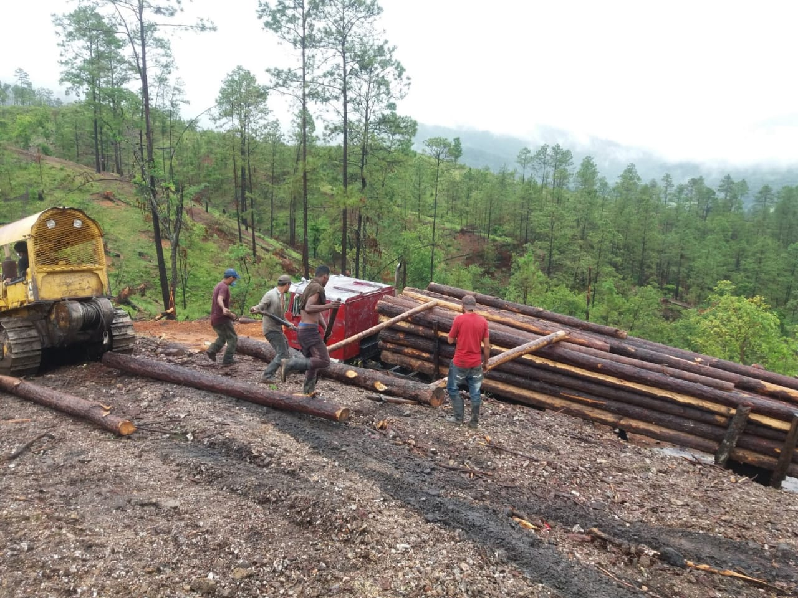
                       

                    

                

            

        </section>

    </section>

    <!-- Lightbox -->
    

        &times;
        
        

    

    <!-- Pie de página -->
    <footer class="bg-green-900 text-white py-6 text-center">
        
&copy; 2025 FEHCAFOR.

    </footer>

    
</body>

</html>

<!DOCTYPE html>
<html lang="es">

<head>
    <meta charset="UTF-8">
    <meta name="viewport" content="width=device-width, initial-scale=1.0">
    <title>FEHCAFOR - Enlaces de interes</title>
    
    <link href="https://fonts.googleapis.com/css2?family=Poppins:wght@300;400;600;700&display=swap" rel="stylesheet">
    
</head>

<body class="bg-gray-50">
    <!-- Scroll to Top Button -->
    <button class="scroll-to-top" onclick="window.scrollTo({top: 0, behavior: 'smooth'})"
        aria-label="Ir arriba">↑</button>

    <!-- Barra de navegación -->
    <nav
        class="bg-green-900 bg-opacity-95 backdrop-blur-sm text-white fixed top-0 w-full z-50 flex justify-between items-center navbar-spaced transition-all duration-300">
        <ul class="flex space-x-8">
            <li><a href="inicio.html" class="hover:text-yellow-400 font-semibold transition duration-200">Inicio</a>
            </li>
            <li><a href="quienes-somos.html" class="hover:text-yellow-400 font-semibold transition duration-200">Quiénes
                    Somos</a></li>
            <li><a href="sala-informativa.html" class="hover:text-yellow-400 font-semibold transition duration-200">Sala
                    Informativa</a>
            </li>
            <li><a href="galeria.html" class="hover:text-yellow-400 font-semibold transition duration-200">Galeria</a>
            </li>
            <li><a href="enlaces-interes.html"
                    class="hover:text-yellow-400 font-semibold transition duration-200">Enlaces de Interes</a></li>

            <li><a href="contactos.html"
                    class="hover:text-yellow-400 font-semibold transition duration-200">contactanos</a>
            </li>
        </ul>
    </nav>

    <!-- Sección fija para el logo y texto debajo de la barra de navegación -->
    

        <!-- Reduje el tamaño para que quepa mejor -->
        

            <h1 class="text-3xl font-bold text-green-700 mb-2">FEHCAFOR</h1>
            
<b>FEDERACIÓN HONDUREÑA DE COOPERATIVAS AGROFORESTALES</b>

        

    
        

 <!-- Sección de enlaces de interés -->
    <section id="enlaces-interes" class="py-20 bg-gray-100">
        

            <h2 class="text-4xl font-bold text-center text-black-900 mb-10">Enlaces de interes</h2>
            

                <a href="https://www.facebook.com/institutodeconservacion.icf/?locale=es_LA" class="link-card flex flex-col items-center p-6 bg-white rounded-xl shadow-md hover:bg-blue-100">
                    <svg xmlns="http://www.w3.org/2000/svg" width="50" height="50" viewBox="0 0 24 24" fill="none" stroke="#1033e5" stroke-width="2" stroke-linecap="round" stroke-linejoin="round">
                        <path stroke="none" d="M0 0h24v24H0z" fill="none" />
                        <path d="M7 10v4h3v7h4v-7h3l1 -4h-4v-2a1 1 0 0 1 1 -1h3v-4h-3a5 5 0 0 0 -5 5v2h-3" />
                    </svg>
                    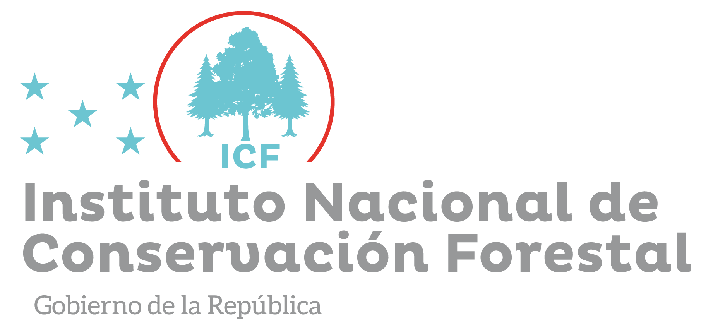
                </a>
                <a href="https://www.facebook.com/UnionEuropeaEnHonduras" class="link-card flex flex-col items-center p-6 bg-white rounded-xl shadow-md hover:bg-blue-100">
                    <svg xmlns="http://www.w3.org/2000/svg" width="50" height="50" viewBox="0 0 24 24" fill="none" stroke="#1033e5" stroke-width="2" stroke-linecap="round" stroke-linejoin="round">
                        <path stroke="none" d="M0 0h24v24H0z" fill="none" />
                        <path d="M7 10v4h3v7h4v-7h3l1 -4h-4v-2a1 1 0 0 1 1 -1h3v-4h-3a5 5 0 0 0 -5 5v2h-3" />
                    </svg>
                    
                </a>
                <a href="https://www.facebook.com/UNFAO" class="link-card flex flex-col items-center p-6 bg-white rounded-xl shadow-md hover:bg-blue-100">
                    <svg xmlns="http://www.w3.org/2000/svg" width="50" height="50" viewBox="0 0 24 24" fill="none" stroke="#1033e5" stroke-width="2" stroke-linecap="round" stroke-linejoin="round">
                        <path stroke="none" d="M0 0h24v24H0z" fill="none" />
                        <path d="M7 10v4h3v7h4v-7h3l1 -4h-4v-2a1 1 0 0 1 1 -1h3v-4h-3a5 5 0 0 0 -5 5v2h-3" />
                    </svg>
                    
                </a>
                <a href="https://www.facebook.com/onumujereshn" class="link-card flex flex-col items-center p-6 bg-white rounded-xl shadow-md hover:bg-blue-100">
                    <svg xmlns="http://www.w3.org/2000/svg" width="50" height="50" viewBox="0 0 24 24" fill="none" stroke="#1033e5" stroke-width="2" stroke-linecap="round" stroke-linejoin="round">
                        <path stroke="none" d="M0 0h24v24H0z" fill="none" />
                        <path d="M7 10v4h3v7h4v-7h3l1 -4h-4v-2a1 1 0 0 1 1 -1h3v-4h-3a5 5 0 0 0 -5 5v2h-3" />
                    </svg>
                    
                </a>
            

        

    </section>

    <!-- Pie de página -->
    <footer class="bg-green-900 text-white py-6 text-center">
        
&copy; 2025 FEHCAFOR.

    </footer>

    
</body>
</html>

<!DOCTYPE html>
<html lang="es">

<head>
    <meta charset="UTF-8">
    <meta name="viewport" content="width=device-width, initial-scale=1.0">
    <title>FEHCAFOR - Contactos</title>
    
    <link href="https://fonts.googleapis.com/css2?family=Poppins:wght@300;400;600;700&display=swap" rel="stylesheet">
    

    </style>
</head>

<body class="bg-gray-50">
    <!-- Scroll to Top Button -->
    <button class="scroll-to-top" onclick="window.scrollTo({top: 0, behavior: 'smooth'})"
        aria-label="Ir arriba">↑</button>

    <!-- Barra de navegación -->
    <nav
        class="bg-green-900 bg-opacity-95 backdrop-blur-sm text-white fixed top-0 w-full z-50 flex justify-between items-center navbar-spaced transition-all duration-300">
        <ul class="flex space-x-8">
            <li><a href="inicio.html" class="hover:text-yellow-400 font-semibold transition duration-200">Inicio</a>
            </li>
            <li><a href="quienes-somos.html" class="hover:text-yellow-400 font-semibold transition duration-200">Quiénes
                    Somos</a></li>
            <li><a href="sala-informativa.html" class="hover:text-yellow-400 font-semibold transition duration-200">Sala
                    Informativa</a>
            </li>
            <li><a href="galeria.html" class="hover:text-yellow-400 font-semibold transition duration-200">Galeria</a>
            </li>
            <li><a href="enlaces-interes.html"
                    class="hover:text-yellow-400 font-semibold transition duration-200">Enlaces de Interes</a></li>

            <li><a href="contactos.html"
                    class="hover:text-yellow-400 font-semibold transition duration-200">contactanos</a>
            </li>
        </ul>
    </nav>

    <!-- Sección fija para el logo y texto debajo de la barra de navegación -->
    

        <!-- Reduje el tamaño para que quepa mejor -->
        

            <h1 class="text-3xl font-bold text-green-700 mb-2">FEHCAFOR</h1>
            
<b>FEDERACIÓN HONDUREÑA DE COOPERATIVAS AGROFORESTALES</b>

        

    
        

    <!-- Sección de Contacto -->
    <section id="contacto" class="py-16 bg-gray-100">
        

            <h2 class="text-3xl font-bold text-center mb-6">Contacto con FEHCAFOR</h2>
            

                
Envíanos un mensaje o contacta directamente para obtener más información
                    sobre nuestras actividades.

                <form action="https://formspree.io/your-email@example.com" method="POST">
                    <!-- Reemplaza con tu endpoint de formulario -->
                    <input type="text" name="name" placeholder="Tu nombre" required class="mb-4">
                    <input type="email" name="email" placeholder="Tu correo electrónico" required class="mb-4">
                    <textarea name="message" placeholder="Tu mensaje" rows="4" required class="mb-4"></textarea>
                    <button type="submit">Enviar Mensaje</button>
                </form>  
                

                    
<strong>Correo:</strong> <a href="mailto:fehcafor1974@gmail.com"
                            class="text-blue-600 hover:underline">fehcafor1974@gmail.com</a>

                    
<strong>Teléfono:</strong> <a href="tel:+50422270059" class="text-blue-600 hover:underline">+504
                            2227-0059</a>

                    
<strong>Dirección:</strong> <a
                            href="https://www.google.com/maps/search/Colonia+Mayangle+2da+entrada%2C+casa+1659%2C+una+cuadra+Oeste+de+Cruz+Roja+Hondureña%2C+Comayagüela%2C+Honduras"
                            target="_blank" class="text-blue-600 hover:underline">Col- Mayangle. esquina opuesta a Cruz
                            Roja Hondureña, contiguo a Save The Childrens, Casa No. 2211.</a>

                    
O síguenos en redes para actualizaciones en tiempo real:

                    <a href="https://www.facebook.com/FEHCAFOR" target="_blank"
                        class="text-blue-600 hover:underline">Página de Facebook de FEHCAFOR</a>
                

            

        

    </section>

    <!-- Pie de página -->
    <footer class="bg-green-900 text-white py-6 text-center">
        
&copy; 2025 FEHCAFOR.

    </footer>

    
</body>

</html>

